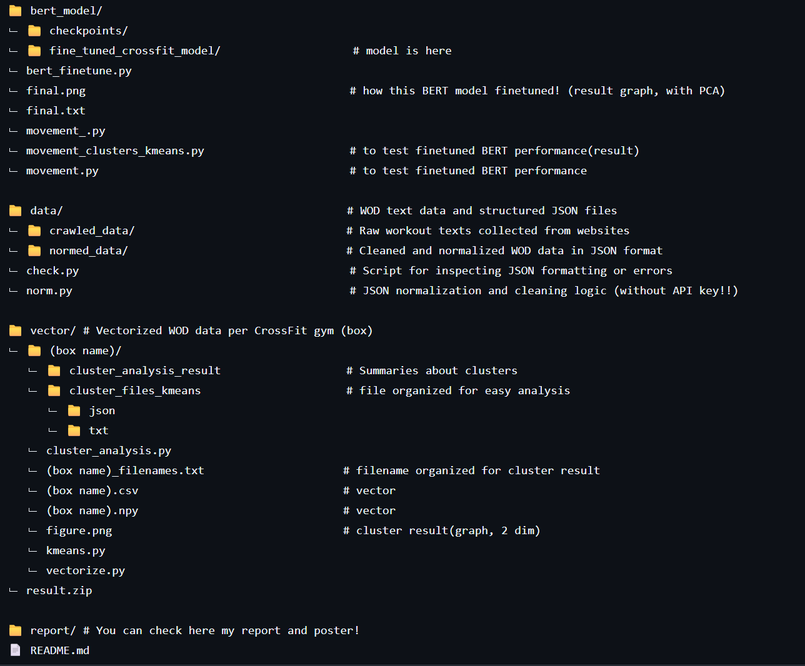

# Box to Box: Analyzing CrossFit WOD Variability with Structured Embeddings

Hi, thanks for your interest in this project.
This repository is about project <Analyzing CrossFit WOD (Workout of the Day) variability> using structured JSON embeddings and KMeans clustering.

Here's the structure of this repository,
and if you want to know the details, 
check my `report/Analyzing Crossfit WOD Variability with Structured Embeddings.pdf` !

